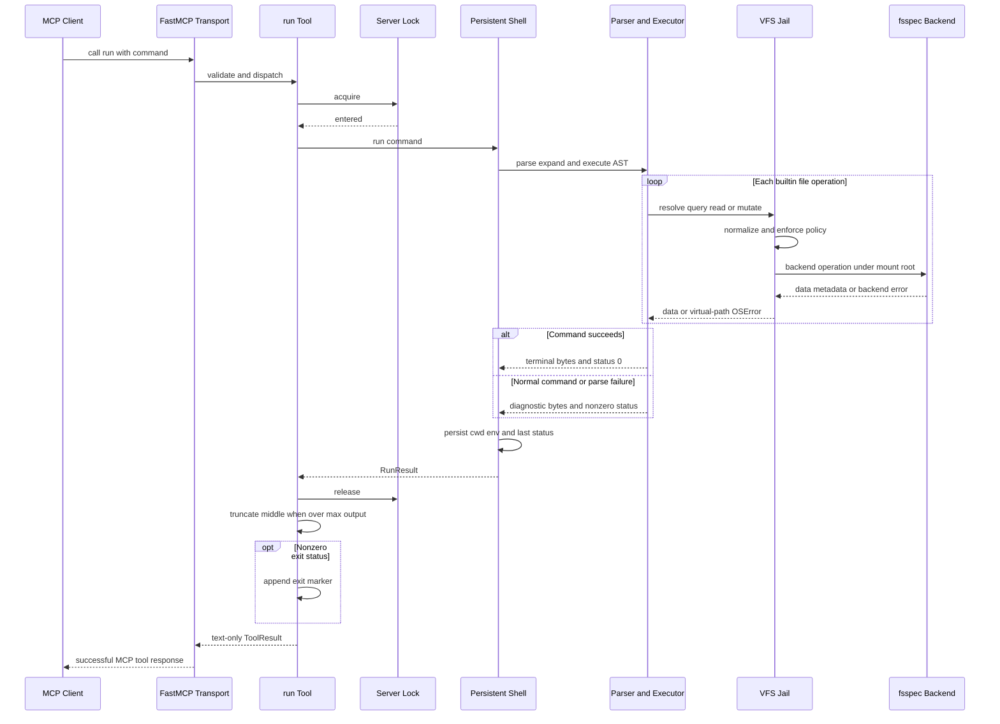
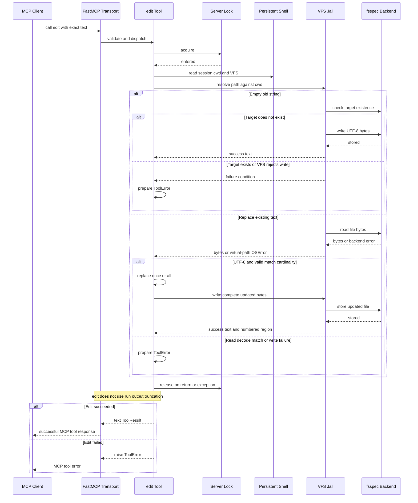

# Runtime Architecture and End-to-End Requests

mcpath is a long-lived MCP server around a deliberately small execution core. At startup it turns one local path or fsspec URL into a jailed `VFS`, constructs exactly one stateful `Shell`, and registers closures for the MCP tools. At request time FastMCP may dispatch calls concurrently, but both tools enter the same lock before touching the shared shell session. Shell commands are parsed and interpreted as Python builtins; they do not spawn operating-system processes. All persistent-file operations cross the VFS boundary before reaching fsspec.

<!-- openwiki: broken internal link [../reference/tools-and-command-surface.md] file "../reference/tools-and-command-surface.md" does not exist. Fix the href or restore the target, then delete this comment. -->
This page follows that complete path. See [Shell Engine](../concepts/shell-engine.md) for parser and executor semantics, [Virtual Filesystem Security](../concepts/virtual-filesystem-security.md) for the jail's threat model, and [Tools and Command Surface](../reference/tools-and-command-surface.md) for the client-facing API.

## Startup and ownership

The installed `mcpath` console script calls `mcpath.main`. Its `argparse` configuration accepts a mount root (default `.`), read-only and additional deny rules, a maximum result size, and transport settings. `main` then performs these steps in order:

1. `VFS.from_url(root, ...)` delegates URL interpretation to `fsspec.core.url_to_fs`, combines the built-in deny patterns with every `--deny`, and validates that the resulting backend root is a directory. For a local backend the root is canonicalized with `realpath`.
2. `create_server(vfs, max_output=...)` allocates one `Shell(vfs)`, one non-reentrant `threading.Lock`, and one `FastMCP("mcpath", ...)` object. The registered tool functions close over that shell and lock.
3. `run` is always registered. `edit` is registered only when `vfs.read_only` is false; read-only is also reflected in the `run` description and MCP annotations.
4. `server.run(...)` owns transport delivery. The default stdio mode suppresses FastMCP's banner because process stdout carries MCP protocol frames and nothing else may be printed there. HTTP mode passes `host` and `port` to FastMCP.

<!-- openwiki: broken internal link [../operations/configuration-and-deployment.md] file "../operations/configuration-and-deployment.md" does not exist. Fix the href or restore the target, then delete this comment. -->
The configuration surface and launch examples are covered in [Configuration and Deployment](../operations/configuration-and-deployment.md).

| Owner | Lifetime and responsibility |
| --- | --- |
| CLI process | Parses configuration, creates the mount and server, then runs the selected transport. |
| `FastMCP` server | Publishes tool schemas, validates calls, invokes tool closures, and delivers `ToolResult` or `ToolError` through the transport. |
| `VFS` | Owns the fsspec backend/root mapping, deny rules, read-only policy, maximum read size, path checks, and backend-error translation. |
| `Shell` | Owns the one persistent `Session` used by the server: `cwd`, environment variables, and `last_status`. |
| Server lock | Serializes complete `run` and `edit` critical sections over the shared shell and mount. |
| A `Shell.run` invocation | Owns in-memory stdin/stdout/stderr streams, parsing, expansion, AST execution, and its `RunResult`. |

### Process lifetime is not MCP session lifetime

The persistent state belongs to the `Shell` captured by `create_server`, not to an MCP request and not to a protocol-level session object. `cwd` starts at `/`; `HOME` and `PWD` start at `/`; assignments, successful `cd` operations, and the latest command status update the same `Session` across later calls. `$?` reads `last_status`. Subshells, command substitutions, and stages of a multi-command pipeline receive copies, so state changes in those scopes do not leak back.

Consequently, process topology determines state isolation:

- With the normal stdio deployment, each client launches its own server process. The single shell normally lives for that connection/process and disappears when it exits.
- An HTTP server is one longer-lived process. Since `create_server` still owns only one shell, calls reaching that server instance share shell state; the implementation does not allocate one `Shell` per HTTP client or MCP session.

The lock preserves call-level atomicity, not per-client isolation. A call such as `cd /src; pwd; cd /` completes before another `run` or `edit` can enter. This prevents interleaving mutations of `cwd` and variables, but callers still observe state left by earlier completed calls.

## `run(command)` end to end

*The `run` request is serialized around the persistent shell; ordinary shell failures remain successful MCP tool results, and formatting occurs after releasing the lock.*

`Shell.run` creates a fresh terminal collector for each call. Separate `_Tee` streams retain stdout and stderr individually while also writing both into one terminal buffer in execution order. The parser produces an AST; expansion resolves variables, command substitution, braces and globs; `_Executor` walks control-flow nodes. Only simple commands look up a function in `BUILTINS`. Pipelines are buffered and run stage by stage, with one stage's complete stdout becoming the next stage's stdin. Redirection targets become VFS reads or `FileOutput` writes. The special `/dev/null` target is handled by the executor as an in-memory sink/source rather than a VFS file.

A builtin receives a `CommandContext`, not a host process. Its paths resolve against the persistent virtual `cwd`, its I/O goes through executor-provided streams, and its file access uses `session.vfs`. Unknown commands return 127. Parse errors return 2, loop-limit errors return 1, and an unexpected exception inside a builtin is converted to an `internal error` diagnostic and status 1 so it does not kill the shell session.

### Formatting and failure semantics

`format_output` begins with the terminal buffer decoded using replacement characters for invalid byte sequences. If it exceeds `max_output`, formatting retains approximately the first two thirds and last third and inserts a note reporting omitted lines and characters. Keeping the tail preserves summaries and late diagnostics. Only after truncation does it append `[exit N]` for a nonzero status, inserting a newline when needed.

This distinction is an important protocol invariant:

- A shell command returning nonzero is a **normal, successful MCP tool call**. The client receives terminal text followed by `[exit N]`, and `is_error` remains false.
- A successful command's text is untouched unless it is too large; status 0 has no exit marker.
- The truncation limit applies to `run`'s returned terminal text. It does not limit data redirected into a file and is not applied to the `edit` response.

## `edit(path, old_string, new_string, replace_all=False)` end to end

*The `edit` request shares the shell's current directory and the server lock, while validation failures become `ToolError` responses rather than shell exit markers.*

`edit` deliberately bypasses shell parsing but not the filesystem boundary. It takes `shell.session.vfs` and resolves a relative `path` against `shell.session.cwd`, so a preceding `run("cd src")` changes where `edit("main.py", ...)` operates. Reads and writes still pass through VFS confinement, deny, read-only, size, and error-translation checks.

There are two modes:

- If `old_string == ""`, the target must not already exist. `new_string` is UTF-8 encoded and written as a new file. Existing targets are rejected rather than overwritten.
- Otherwise the existing file must be readable UTF-8 text. Identical old and new strings, zero matches, and multiple matches without `replace_all=True` are rejected before writing. A valid operation rewrites the complete encoded file, either replacing the first match or all matches.

Success returns `Created /virtual/path.` or an `Edited ...` message plus a small line-numbered window around the first changed region. Failures are prefixed `edit: <caller path>:` and raised as FastMCP `ToolError`: missing files, non-UTF-8 input, ambiguous or absent matches, and VFS write failures therefore set MCP tool-error semantics. This differs intentionally from `run`, where command errors are terminal output and a normal `ToolResult`.

## The VFS enforcement boundary

Every ordinary shell or edit storage operation reaches a VFS public method. Each such method starts by resolving an absolute virtual path and checking policy before mapping it beneath the backend root:

- `..` is normalized in virtual path space and clamps at `/`; it cannot select a host parent.
- A deny pattern is matched against every path component. Denied paths fail with `EACCES`, are omitted from directory listings, and cannot be created.
- On local filesystems, `realpath` checks reject accesses through symlinks that leave the configured root; such entries are also hidden from listings.
- Every mutation calls `_check_writable`, which returns `EROFS` in read-only mode. Omitting `edit` is therefore a reduced tool surface, while VFS enforcement remains the defense for shell redirections and mutating builtins.
- Backend exceptions are translated to standard `OSError` subclasses whose filename is the virtual path. Host paths are not returned to builtins or clients.
- VFS prechecks normalize backend differences, including directory reads, missing parent directories, and maximum file reads. The default per-file read ceiling is 10 MiB.

After policy checks, fsspec is the storage extension boundary. The shell and editor are backend-agnostic: adding or configuring a local, memory, object-store, archive, or other fsspec URL changes `fs` and `_root`, not request execution. A backend must still present the directory and file operations expected by `VFS`.

## Concurrency, invariants, and safe changes

The central invariants are:

1. **One shell per `create_server` call.** Do not move `Shell(vfs)` into a tool function unless intentionally changing persistence semantics.
2. **Serialize both tools with the same lock.** Locking only `run` would allow `edit` to resolve a path while another call changes `cwd`; locking individual commands would permit a multi-command call to interleave.
3. **Keep stdio stdout protocol-only.** Diagnostics from shell execution belong in collected streams and `ToolResult`; process logging must not print to stdout in stdio mode.
4. **Keep command failure separate from tool failure.** Nonzero shell statuses are data for the agent and must remain successful `ToolResult`s with `[exit N]`. Input/edit contract violations are `ToolError`s.
5. **Keep storage behind VFS.** New builtins and edit-like tools should use `CommandContext.vfs` or `shell.session.vfs`, never host `open`, `os` mutation APIs, or backend paths.
6. **Enforce read-only twice.** The server omits `edit`, and VFS refuses all mutation paths used by builtins and redirections.

The builtin registry is the command extension point: adding a registered Python builtin makes it available to `_Executor` and automatically updates the generated `run` description from `BUILTINS`. fsspec is the storage extension point. New MCP tools require more care: if they depend on shell state or touch the mount, they should close over the same shell, VFS, and lock and should explicitly choose between normal `ToolResult` failures and `ToolError` failures.

## Focused verification

The most architecture-relevant tests cross boundaries rather than only testing helpers:

- `tests/test_server.py` uses a real FastMCP `Client` over the in-memory transport. It verifies tool discovery, omission of `edit` in read-only mode, plain text results without a JSON wrapper, normal-result command failures, state persistence, non-interleaving concurrent calls, middle truncation, exact edits, error responses, creation, cwd-relative paths, and jail enforcement.
- `tests/shell/test_executor.py` verifies terminal ordering, persistent `cd` and variables, `$?`, copied subshell/pipeline state, parser and command-not-found statuses, redirects through VFS, and loop termination.
- `tests/test_vfs.py` runs most behavior against both memory and local backends. It covers root clamping, deny hiding, uniform POSIX-like errors, read-only mutation rejection, virtual-only error paths, output-independent file operations, local symlink escape prevention, and URL-backed construction.

When changing request flow, retain at least one FastMCP-level test: direct calls to `_edit`, `Shell`, or `VFS` cannot prove tool registration, MCP error classification, annotations, serialization, or transport result shape.
