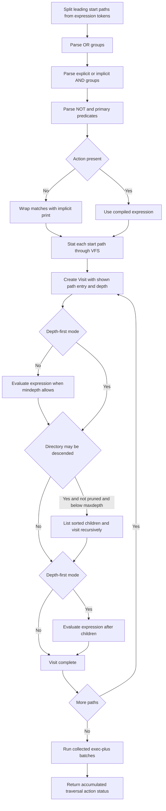

# Builtin Command System and Specialized Semantics

The shell's commands are in-process Python functions, not host executables. This is an important isolation boundary: a builtin receives a `CommandContext`, performs file operations through `ctx.vfs`, consumes and produces the supplied in-memory streams, and returns an integer status. It must not use `open`, `os` filesystem operations, or `subprocess` to escape that model. Consequently, the same command works against any VFS backend, inherits path confinement, deny rules, read-only enforcement, and normalized virtual errors, and cannot start an unregistered host command.

This page focuses on command semantics. The surrounding AST execution and pipeline model are covered in [Shell Engine](shell-engine.md), while VFS confinement is covered in [Virtual Filesystem Security](virtual-filesystem-security.md).

## Registration and invocation boundary

`@builtin(*names)` installs a function in the process-wide `BUILTINS` dictionary under each supplied name and returns the function unchanged. Importing `mcpath.shell.builtins` imports `core`, `files`, `find`, `grep`, and `text` for their registration side effects. The resulting command surface includes state commands, file readers and mutators, text tools, `grep`, `find`, and `xargs`; the server also uses the registry to advertise the available command names.

Only the executor invokes a builtin. `_Executor._run_argv` looks up `argv[0]`; an unknown name reports `command not found`, lists the registry, and returns 127. For a known command it constructs `CommandContext` and calls the registered function. There is no fallback to `$PATH` or a child process.

`CommandContext` is the complete command-facing contract:

- `argv`, `name`, and `args` retain the expanded command and operands.
- `streams` supplies `Input`, stdout, and stderr. `ctx.stdin.read()` consumes the unread remainder; `readline()` advances one line at a time. `ctx.out()` encodes text, while `ctx.write()` preserves bytes.
- `session` owns persistent `cwd`, environment, last status, and the VFS. `ctx.env` is the command's environment view, including temporary `X=1 cmd` assignments; persistent state changes such as `cd` must update `ctx.session`.
- `ctx.resolve(path)` resolves a user path against the virtual current directory. Filesystem reads, metadata, traversal, and mutation then go through `ctx.vfs`.
- `run_command(argv, streams)` re-enters the same builtin dispatcher. It exists for nested execution by `find -exec` and `xargs`, not for launching host processes.
- `error`, `os_error`, and `usage_error` provide command-prefixed diagnostics. `usage_error` additionally prints the GNU-style `Try 'name --help'` hint.

The executor owns pipeline and redirection plumbing. A builtin should never ask whether stdout is a terminal, pipe, or redirect: it writes to the supplied stream. Pipelines are buffered stage by stage, and redirected output is committed to the VFS by `FileOutput`. This separation also lets nested commands share their parent's stdout and stderr while receiving a fresh empty stdin.

The invocation boundary contains failures. `BuiltinExit` is the intentional early-return mechanism used by option help. Any other exception escaping a builtin is converted to `name: internal error: Type: message` and status 1, so one implementation bug does not terminate the shell session.

## Shared parsing, input, and diagnostic conventions

### GNU-style option parsing

Builtins that use `_options.parse` declare an `Opt` list rather than hand-parsing each spelling. A definition can provide a short name, long name, value converter, repeatability, and an explicit destination shared by aliases. Parsed keys use underscores; absent flags are false, absent valued options are `None`, and repeatable options are lists.

The parser supports:

- option permutation by default, so options can follow operands;
- bundled short flags and attached values such as `-rn`, `-A3`, and `-k2,2`;
- `--long=value` and a following value argument;
- non-empty, unambiguous long-option abbreviations;
- `--` as the end of options;
- `permute=False` when the first operand must end parsing, as in `xargs grep -n x`, where `-n` belongs to `grep`.

A conversion failure, missing value, ambiguous or unknown long option, or unknown short option produces a command-prefixed error with the supported option spellings; `parse` returns `None`, and callers normally return status 2. If `--help` occurs before `--`, the parser writes generated usage text and raises `BuiltinExit(0)`. This help behavior belongs to commands using the shared parser; small hand-parsed commands such as `echo` do not automatically acquire it.

### Inputs and lines

`Inputs(ctx, paths, describe=...)` centralizes the usual “files, or stdin” contract. No operands becomes `-`; each `-` consumes the context's current stdin, while other operands are resolved and read as bytes through the VFS. Read failures are reported, skipped, and remembered as status 1 so a multi-file command can continue. `describe` lets commands retain tool-specific error wording.

The `lines(data)` helper splits only on byte `\n` and keeps each terminator; unlike `bytes.splitlines`, it does not treat a bare `\r` as a Unix line boundary. This matters for byte counts, missing final newlines, and exact pipeline output.

### Statuses are command semantics

The broad convention is 0 for success, 1 for an ordinary false result or operational failure, and 2 for bad options, but compatibility can override it. For example, `grep` uses 0 for a selected line, 1 for no selected line, and 2 for an error; `sort` returns 2 for unreadable input; `ls` uses 2 for access/listing errors; and `find` expression syntax currently returns 1. Callers must preserve the implementation's command-specific mapping rather than flatten every nonzero outcome.

Paths in diagnostics are generally the spelling supplied by the user, while resolved absolute virtual paths are used for VFS operations. Catch expected `OSError` close to the relevant operand, print it through the context helpers, continue where GNU tools continue, and aggregate the proper status.

## `grep`: regex dialect, traversal, and binary policy

`grep` first removes `--color` and `--colour` arguments because output is not terminal-colored, parses options, obtains patterns from repeated `-e` or the first operand, and expands newline-containing pattern arguments into separate patterns. It then compiles matchers, determines context widths and filename-prefix policy, walks targets, and accumulates match/error/early-stop state across files.

Python regular expressions are not accepted as a substitute for POSIX semantics. Unless `-F` or `-P` is selected, `_translate` converts the pattern:

- default BRE makes escaped `\(`, `\)`, `\{`, `\}`, `\|`, `\+`, and `\?` special while their unescaped forms are literal;
- `-E` uses ERE-style unescaped operators;
- POSIX classes such as `[[:alpha:]]`, word boundaries `\<` and `\>`, bracket-expression escaping, and unmatched-delimiter errors are translated explicitly;
- `-F` escapes the whole pattern, while `-P` passes it directly to Python `re`;
- `-w` and `-x` wrap the resulting expression, and `-i` sets case-insensitive matching.

Recursive search defaults to `.` only when `-r` has no targets. VFS directory entries give deterministic sorted traversal. `--exclude-dir` prevents descent based on the directory basename; `--include` requires a filename match, and `--exclude` rejects matching filenames. The file filters apply both during recursive traversal and to explicitly named regular files. An implicit `.` root omits the `./` display prefix, whereas an explicit root retains the user's spelling.

A NUL byte marks data as binary unless `-a` requests text. `-I` skips such a file. Otherwise matching is still computed, but ordinary matching-line output is suppressed; in ordinary output mode a selected binary file emits `grep: name: binary file matches` unless `-q` applies. Bytes are decoded and re-encoded with UTF-8 `surrogateescape`, preserving undecodable bytes in text processing. Count and file-listing modes suppress ordinary rows, `-q` stops all further work as soon as a selection is found, and a quiet match wins over an otherwise recorded error. Final status is 0 for a selection, 1 for none, or 2 for an error.

Context output tracks selected and neighboring rows, uses `:` for selected-line prefixes and `-` for context, and emits `--` between disjoint groups—even across files through shared state. `-m` still permits trailing after-context. `-o` finds non-overlapping matches from all patterns, preferring the earliest and then longest match and advancing past empty matches.

## `find`: expression compilation and traversal

`find` separates leading start paths from its expression tokens, then uses a recursive-descent parser to compile the expression into a callable from `_Visit` to `bool`. OR has the lowest precedence, adjacent predicates imply AND (as do `-a` and `-and`), NOT is recursive, and parentheses group. Python's short-circuit `or` and `and` preserve action semantics: an action executes only if evaluation reaches it.

*The `find` parser establishes implicit-AND precedence, then traversal applies pruning, depth ordering, actions, and deferred `-exec ... {} +` batches.*

Without an explicit action (`-print`, `-print0`, `-delete`, or `-exec`), `find` wraps the expression with implicit newline printing. `-prune` marks the current visit and returns true; in normal pre-order traversal that prevents descent. `-maxdepth` controls descent, while `-mindepth` suppresses evaluation without preventing traversal. Symlinked directories are not descended.

`-delete` forces depth-first mode so children are removed before their directory. It records an action failure as overall status 1 and deliberately does not delete a starting `.` or `..`. Because depth-first expressions run only after descent, pruning cannot prevent descent in that mode. `-quit` unwinds traversal immediately, after which already-collected batches are still processed.

`-exec cmd ... {} \;` substitutes every occurrence of `{}` in each argument, gives the nested command empty stdin and shared output streams, and returns true only when that invocation returns 0. `-exec cmd ... {} +` is accepted only when `{}` is the final command argument; matching shown paths are collected and a single command per batch expression runs after traversal. Any nonzero batched invocation sets `find` status 1.

## `xargs`: parsing data and re-entering builtins

`xargs` stops its own option parsing at the command name and defaults to `echo`. Input is decoded with replacement for invalid bytes. Its default splitter recognizes blanks, single and double quotes, and backslash quoting; unmatched quotes are an error. `-0` uses NUL-delimited items, `-d` interprets an explicit delimiter, and `-I` or `-L` switches to nonblank input lines with leading blanks removed.

Without replacement, `-n` or `-L` determines group size; otherwise all items form one invocation. Empty input still invokes the command once unless `-r` is present. With `-I`, each item creates one argv with placeholder replacement. Each batch re-enters `ctx.run_command` with empty stdin and the caller's stdout/stderr, so only registered builtins can run and nested output remains in the surrounding pipeline or redirect. `-t` prints the argv to stderr before invocation.

Status mapping follows the useful `xargs` conventions: nested 127 returns 127 immediately; nested 255 prints an abort diagnostic and becomes 124; any other nonzero result makes the eventual status 123; otherwise it is 0. This mapping is why `xargs` must inspect nested statuses rather than merely return the last command's code.

## `sort` and `uniq`: byte-oriented text behavior

`sort` and `uniq` operate on bytes. This models C-locale ordering and avoids locale-dependent Unicode collation: for example, uppercase `B` compares before lowercase `a`. `sort` concatenates all readable inputs, inserts a newline between a nonterminated file and the next input, and compares newline-stripped rows.

A `-k` specification is parsed into start field/character, optional end field/character, and per-key `b`, `f`, `n`, and `r` modifiers. Without `-t`, a field is a nonblank run together with its preceding blanks—a GNU quirk that changes character offsets in aligned columns. With `-t`, separators delimit fields exactly. Start characters are one-based; an absent end extends through the line, while an end field with no character extends through that field. Global ordering flags apply only to keys that do not declare their own modifiers.

Keys compare numerically, ASCII-folded via byte uppercase, or directly by byte value. Multiple keys are tried in order. Equal keys normally fall back to whole-line byte ordering for deterministic output; `-s` and `-u` suppress that fallback. `-u` then removes adjacent rows equal under the configured keys rather than necessarily byte-identical rows.

`uniq` does not sort. It groups only adjacent equal byte rows, optionally comparing with byte lowercase for `-i`, and supports counts, repeated-only, or unique-only output. It accepts at most one input operand; an apparent output-file operand is rejected in favor of shell redirection.

## Recursive mutation safety and compatibility

File mutators resolve every operand through the context and call VFS primitives. `rm` refuses recursive removal of virtual `/` and refuses `.` or `..` directory operands; `-f` suppresses only missing-path errors. `mv` rejects moving a source beneath itself. Both `mv` and `cp` share source/target expansion so multiple sources require a directory and preserve the source basename.

Recursive `cp` snapshots `list(vfs.walk(vsrc))` **before** creating the destination. This prevents a newly created destination below the source from becoming fresh traversal input. To match GNU's non-obvious behavior, copying a directory into itself first copies the pre-existing snapshot to the requested child and then reports the self-copy error, yielding a partial copy and status 1 rather than recursing forever. Ordinary tree copies create destination directories as needed and copy files through VFS operations.

## Adding or changing a builtin

A new command should preserve these invariants:

1. Implement `Callable[[CommandContext], int]` and register it with `@builtin("name")`; add its module to the package imports if it is new.
2. Use `ctx.args`, shared option parsing where applicable, and explicit command-specific status mappings. Return 2 for parser failures unless compatibility requires otherwise.
3. Read stdin from `ctx.stdin`; write only to `ctx.out`, `ctx.write`, or the supplied stderr. Never special-case pipeline or redirect destinations.
4. Resolve user paths with `ctx.resolve` and perform every filesystem query or mutation through `ctx.vfs`. Keep user spellings for diagnostics. Do not use the host filesystem or spawn processes.
5. Catch expected per-operand `OSError`, use `ctx.os_error` or exact GNU-compatible wording, continue across operands when appropriate, and accumulate status.
6. Use `Inputs` for standard file-or-stdin iteration and `lines` when Unix byte-line semantics apply. Use `run_command` for nested commands, with deliberate stream and status behavior.
7. Consider traversal order, symlink descent, deterministic VFS listing order, incomplete final lines, binary bytes, multiple operands, partial mutations, and whether action truth values affect a surrounding expression.

The primary compatibility suite runs each command against both mcpath and real Bash/GNU tools in `LC_ALL=C` over identical trees. It compares stdout, stderr, and exit code separately; mutating cases additionally compare the complete resulting directory trees. High-value focused cases cover BRE versus ERE, context and binary grep, recursive include/exclude filters, sort key modifiers, `find` precedence/pruning/`-exec`, `xargs` grouping, missing inputs, and recursive copy/move/remove edge cases. When changing semantics, add a differential case that exposes the precise output, status, and filesystem consequence—not merely a direct unit test of a helper.
