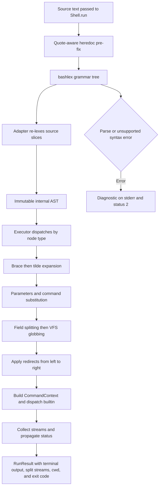
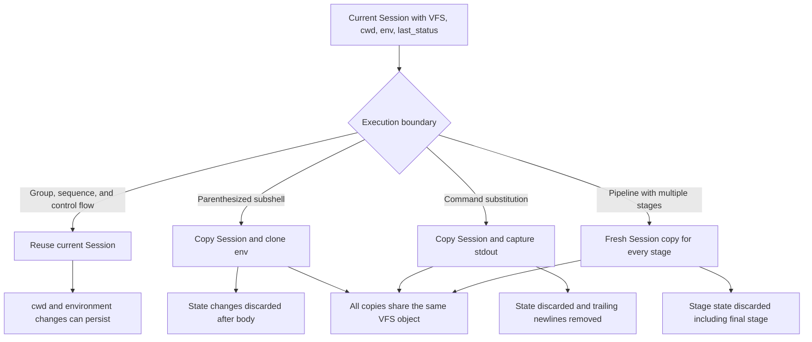

# Shell Language Pipeline: Parse, Expand, and Execute

The mcpath shell is a bounded, in-process interpreter for a deliberately selected Bash-like language. `Shell.run(source)` parses source into an internal immutable AST, expands words against persistent session state and the virtual filesystem, wires in-memory streams and redirects, and invokes only registered Python builtins. It never hands source text to a host shell and never falls back to host executables.

One `Shell` owns one `Session`, initialized with `cwd=/`, `HOME=/`, `PWD=/`, no other environment entries, and status 0. The server retains that shell across tool calls and serializes calls with a lock, so `cd`, standalone assignments, and `$?` have meaningful cross-call state. The shell/VFS boundary and builtin catalog are detailed in [Virtual Filesystem Security](virtual-filesystem-security.md) and [Builtin Command System](builtin-command-system.md).

## End-to-end pipeline

*Source becomes a position-preserving bashlex tree, then an implementation-owned AST; execution performs ordered expansion and redirect setup before builtin dispatch and result assembly.*

`parse()` first rejects empty input. Its heredoc pass works around bashlex's handling of quoted delimiters: for example, it replaces `<<'EOF'` with an unquoted, space-padded delimiter of the same length, records the `<<` position, skips quoted text and heredoc bodies while scanning, and adds a final newline when bashlex needs one. Position preservation lets the adapter continue slicing the corrected source accurately. bashlex supplies the compound-command grammar; `_Adapter` is the only code that consumes its objects.

The adapter does not trust bashlex's quote-stripped word value. `_WordLexer` re-lexes each original source slice into internal parts carrying quote state, recursively parses command substitutions, and gives heredoc bodies their special expansion mode. Parser tests assert only internal AST values, not bashlex types. Consequently, replacing bashlex changes one module as long as the replacement emits the same AST contract.

## Immutable AST contract

Every node in `ast.py` is a frozen, slotted dataclass. Parsing produces a stable description; expansion and execution derive values without mutating it. There are two layers.

### Words and redirects

| Contract | Meaning and invariant |
|---|---|
| `Text(text, quoted)` | Literal characters after quote removal. Single-quoted content is represented only as quoted `Text`, so it cannot contain expandable parts. |
| `Param(name, quoted)` | `$name`, `${name}`, or one-character special parameter. The flag controls later splitting and glob treatment. |
| `CommandSub(body, quoted)` | `$(...)` or backticks, with a recursively parsed `Node` body. |
| `Word(parts)` | One lexical shell word composed of an ordered tuple of `Text`, `Param`, and `CommandSub`. A quoted empty word remains representable. |
| `Assignment(name, value)` | A leading `NAME=value`; its value is a `Word` but follows assignment expansion rules. |
| `FileRedirect(fd, op, target)` | `<`, `>`, or `>>` with an explicit descriptor and word target. The parser fills defaults: 0 for input and 1 for output. `>|` is normalized to `>`. |
| `DupRedirect(fd, target_fd)` | Snapshot-style descriptor duplication such as `2>&1`. |
| `Heredoc(fd, delimiter, body, strip_tabs)` | Here-document input. The parser has removed delimiter quoting and encoded whether the body is literal or expandable in its `Word` parts. Here-strings are represented as heredocs whose body gains a newline. |

Quoted heredoc delimiters produce one quoted literal `Text`. Unquoted heredoc bodies are lexed as if double quoted: parameters and substitutions run, but field splitting and globbing do not. `<<-` tab stripping is handled by bashlex's heredoc value and retained as `strip_tabs` metadata. A here-string (`<<< word`) similarly quotes all resulting parts and appends `\n`.

### Command nodes

| Node | Execution contract |
|---|---|
| `SimpleCommand` | Ordered words, leading assignments, and redirects. Words may be empty for assignment-only or redirect-only commands. |
| `Pipeline` | Ordered command nodes plus `negated` for `!`. An ordinary single command is not wrapped; a negated single command is. |
| `AndOr` | Left and right nodes with `&&` or `||`; chains are left-nested. |
| `Sequence` | Nonempty commands separated by semicolons or newlines, executed in order regardless of failure. |
| `Subshell` | Body and compound redirects, executed with a copied session. |
| `Group` | `{ ...; }` body and redirects, executed in the current session. |
| `If` | Ordered condition/body pairs, optional else body, and compound redirects. |
| `For` | Variable, optional word tuple, body, and redirects. `words=None` denotes the positional-parameter form; this shell has no positional arguments, so it iterates no values. |
| `While` | Condition, body, `until` polarity, and redirects. |

The parser gives `;` and newline the loosest binding, and folds each `&&`/`||` chunk leftward. It normalizes `&> file` and `>& file` to stdout file redirection followed by `2>&1`; `a |& b` appends `2>&1` to the left command. Redirect tuples preserve source order because descriptor duplication depends on the stream mapping at that exact point.

## Quote-aware expansion

`expand_word()` follows this order:

1. **Brace expansion.** Only characters in unquoted `Text` participate. Comma alternatives may nest, and numeric or alphabetic `lo..hi` sequences can ascend or descend. Numeric ranges preserve zero padding when an endpoint is zero-prefixed. Invalid groups such as `{}`, `{x}`, or an unmatched brace stay literal, which preserves `find -exec ... {} ...`.
2. **Tilde expansion.** Only an unquoted leading `~` or `~/...` expands; `~user` and embedded `x~` remain literal. The replacement is `session.env["HOME"]`, defaulting to `/`, and is marked quoted so spaces or glob characters in HOME do not split or glob. In a normal shell session this is the virtual root, not the host user's home.
3. **Parameter and command substitution.** Environment names use `session.env`, with an unset name becoming empty. `$?` is `last_status`, `$0` is `mcpath`, `$#` is `0`, and `$$` is the fixed string `1`; other parsed special parameters that are not separately modeled also resolve through the environment and therefore normally become empty. A command substitution executes its AST in a copied session, captures only stdout, leaves stderr on the surrounding stderr stream, decodes invalid bytes with replacement, and strips all trailing newline characters.
4. **Field splitting.** Unquoted parameter and command-substitution values split on runs of space, tab, or newline. Literal source text does not undergo this split. Quoted contributions keep a field alive even when empty: `""` and `"$UNSET"` produce an empty argument, while an unquoted empty `$UNSET` vanishes.
5. **Pathname expansion.** `*`, `?`, and bracket expressions in unquoted segments are matched one path component at a time through the VFS. Results are sorted and retain the written relative or absolute style. Wildcards do not reveal dot names unless the pattern component starts with `.`, denied entries are absent because VFS listings hide them, and `**` has ordinary `*` behavior rather than recursive globstar behavior. If nothing matches, the original field is preserved.
6. **Quote removal.** This is already represented by parsing: quote characters are absent from `Text`, while their semantic effect remains in `quoted` flags.

The implementation preserves quote provenance within a field, so a word such as `"*"x*` treats the first asterisk literally and only the last as a wildcard. Brace expansion occurs before parameter substitution and cannot inspect generated braces. Likewise, glob characters generated by an unquoted parameter can glob after splitting, while quoted generated characters remain literal.

Two contexts deliberately use narrower rules:

- `expand_assignment()` performs tilde, parameter, and command substitution but never field splitting or globbing.
- `expand_string()` performs parameter and command substitution into exactly one string. It is used for heredoc bodies; their AST has already made quoted-delimiter bodies literal.

A file redirect target goes through full `expand_word()`. Exactly one resulting field is required. Zero fields or multiple fields report `mcpath: target: ambiguous redirect`, return status 1, close any files opened by earlier redirects, and do not run the command. A glob with one match is valid; a no-match glob is preserved and therefore names that literal path.

## Streams, file descriptors, and redirects

`Input` is a byte buffer with a cursor. `read()` consumes the unread remainder, while `readline()` advances one line; this allows repeated `read` calls in a redirected loop to share progress. `Output` appends byte chunks in call order. At the outer boundary, separate stdout and stderr `_Tee` objects each retain their own bytes while forwarding to one terminal `Output`, so `RunResult.output` preserves observable stdout/stderr interleaving and `RunResult.stdout` and `.stderr` remain separately available.

Redirect setup begins from `{0: stdin, 1: stdout, 2: stderr}` and applies every redirect from left to right:

- `< path` reads the whole permitted VFS file into a new `Input`.
- `> path` creates or truncates immediately, even if no command runs or produces bytes.
- `>> path` preserves existing content, then `FileOutput.close()` appends buffered bytes.
- `n>&m` stores the object currently mapped to `m`; later remapping `m` does not change it. Thus `>f 2>&1` sends both streams to the file, while `2>&1 >f` leaves stderr on the prior stdout.
- heredocs install their expanded body as a new `Input`.
- `/dev/null` is not a VFS file: reads yield empty input and writes go to a throwaway `Output`.

File outputs are closed after the command, including on early redirect setup failures where possible. VFS `OSError` during setup produces `mcpath: path: strerror` and status 1 without dispatching the builtin. Close errors are reported to the original stderr. Compound commands (`Subshell`, `Group`, `If`, `For`, and `While`) route their whole execution through the same ordered redirect mechanism.

## Builtin dispatch and assignments

For a simple command, words and assignment values are expanded before redirects are installed. If there is no command name, assignment values update persistent `session.env`; redirects still run, so `> empty.txt` creates a file and returns 0. With a command, prefix values are merged only into `CommandContext.env` and do not persist: `X=1 cmd` sees `X`, but the next command does not.

`_run_argv()` looks up `argv[0]` in the supplied builtin registry. A miss reports the sorted available commands and returns 127; there is no `$PATH` lookup. A hit receives `CommandContext(argv, streams, session, env, run_command)`. `run_command` lets builtins such as `find -exec` and `xargs` re-enter the same registry with explicit streams. `BuiltinExit` becomes its carried code; any other exception escaping a builtin becomes a command-prefixed `internal error` and status 1 rather than terminating the session.

## Execution, session-copy boundaries, and status

*Session copying isolates `cwd`, environment, and status while retaining the shared VFS; groups and ordinary control flow use the original session.*

`Session.copy()` is shallow except for cloning `env`. Therefore copied executions cannot leak `cwd`, environment, or `last_status`, but file mutations still target the same VFS. A parenthesized subshell and every command substitution use a copy. Every stage of a pipeline with more than one command—including the final stage—also gets its own copy; this prevents `cd src | true` from changing the parent directory. Groups intentionally reuse the parent session.

Pipelines are **buffered and sequential**, not concurrent streams. A non-final stage writes all stdout to an `Output`; once it returns, those bytes become the next stage's `Input`. Stderr continues to the pipeline's surrounding stderr unless redirected. The final stage writes to the surrounding stdout. Pipeline status is the last stage's status, regardless of earlier failures, and `!` maps zero to 1 and any nonzero status to 0.

Every executor node returns an integer and updates the session it is using:

- `&&` evaluates the right node only after status 0; `||` evaluates it only after nonzero status.
- a `Sequence` always continues and returns its last item's status;
- `If` selects the first condition returning 0, returns that body status, and returns 0 when no branch is selected and there is no `else`;
- `For` expands its word list once, assigns each value persistently in the active session, and returns the last body status or 0 for no iterations;
- `While` repeats while its condition is 0, while `until` repeats while its condition is nonzero; each returns the last body status or 0 if the body never runs.

Both `For` and `While`/`Until` are bounded by `MAX_LOOP_ITERATIONS = 10_000`. A `for` loop raises before iteration 10,001; a `while` or `until` that does not terminate during its 10,000 allowed condition checks raises after the 10,000th body. `Shell.run()` catches the limit, reports `mcpath: loop stopped after 10000 iterations`, and returns status 1.

At the top level, parse failures print `mcpath: ...` on stderr and use status 2. After any run—including parse failure or a loop limit—`Shell.run()` writes the final status to the persistent session for the next `$?`, and returns `RunResult(output, exit_code, cwd, stdout, stderr)`. `RunResult.text` decodes combined output with replacement. The MCP server later formats that result, truncates overly large display text, and appends `[exit N]` for model-facing nonzero outcomes; those presentation steps are outside the language executor.

## Supported language versus intentional exclusions

Supported composition includes simple commands, assignments, `;` and newlines, `&&`, `||`, `|`, `|&`, `!`, groups, parenthesized subshells, `if`/`elif`/`else`, `for`, `while`, `until`, ordinary redirects, descriptor duplication, heredocs, here-strings, parameters, command substitution, brace expansion, tilde expansion, splitting, and VFS globbing.

The omissions are explicit language boundaries, not accidental builtin failures. They are rejected while parsing and become status 2 through `Shell.run()`:

| Unsupported form | Model-facing diagnostic or guidance |
|---|---|
| `cmd &` | Background jobs are unsupported because commands run one at a time. |
| `case ... esac` | Use `if`/`elif` instead. |
| `[[ ... ]]` | Use `[ ... ]`, the `test` command. |
| `$(( ... ))` | Arithmetic expansion is unsupported. |
| function definitions | Run the commands directly. |
| `<(...)` process substitution | Write output to a file first, then use the file. |
| `${x:-default}` and other parameter operators | Only plain `${name}` is accepted. |
| `$'...'` quoting | Use `printf` instead. |
| unsupported redirect operators | Report `redirection TYPE is not supported`. |
| empty or otherwise malformed input | Report `empty command` or a `syntax error` derived from bashlex. |

The AST intentionally has no generic “unknown Bash construct” node. Adding syntax safely means defining a precise immutable node or normalization, adapting the parser, implementing executor behavior and state boundaries, and adding parser plus end-to-end tests. See [Changing Shell Behavior](../workflows/changing-shell-behavior.md).

## Tests that define the contract

The focused suites divide responsibility clearly:

- `tests/shell/test_parser.py` compares source directly to internal ASTs, covering quote provenance, binding, redirects, heredocs, compounds, and actionable rejection messages. This is the parser-replacement compatibility suite.
- `tests/shell/test_expand.py` runs many brace, split, substitution, and glob cases against real Bash on an equivalent directory, then separately checks deliberate VFS differences such as virtual-root tilde, jailed absolute globs, hidden denied files, no-match preservation, and ambiguous redirects.
- `tests/shell/test_executor.py` checks what a caller observes: interleaved terminal output, persistent and isolated state, short-circuiting, last-stage pipeline status, redirect order, `/dev/null`, heredocs, command substitution, compound redirects, and bounded infinite loops.

When changing semantics, test at the layer that owns the rule and retain at least one end-to-end assertion. In particular, quote bugs often look like glob bugs, redirect-order bugs look like builtin output bugs, and session-copy bugs only appear after a later command inspects state.
