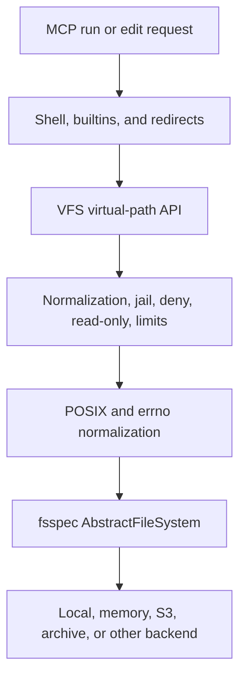
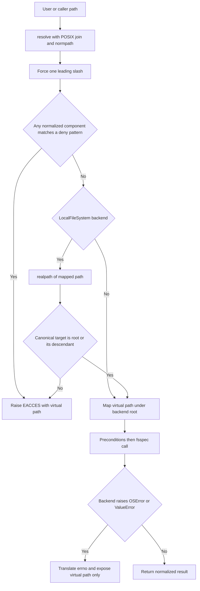

# Virtual Filesystem, Jail, and Storage Semantics

`VFS` is mcpath's storage boundary. The shell and MCP editing tool operate on absolute virtual paths such as `/src/main.py`; `VFS` alone maps those paths to the configured local directory, bucket prefix, archive, or other fsspec root. This concentrates path confinement, deny rules, read-only enforcement, bounded reads, error sanitization, and cross-backend POSIX-like behavior in one auditable layer ([`src/mcpath/vfs.py`](repo://src/mcpath/vfs.py#L1-L20)).

<!-- openwiki: broken internal link [../operations/configuration-and-deployment.md] file "../operations/configuration-and-deployment.md" does not exist. Fix the href or restore the target, then delete this comment. -->
The command-line entry point constructs the boundary with `VFS.from_url()`. `fsspec.core.url_to_fs()` chooses the backend and root from a local path or URL, while `--read-only` and the default plus user-supplied `--deny` patterns become VFS policy ([`src/mcpath/__init__.py`](repo://src/mcpath/__init__.py#L8-L38), [`src/mcpath/vfs.py`](repo://src/mcpath/vfs.py#L66-L92)). See also [Runtime Architecture](../architecture/runtime-architecture.md), [Shell Engine](shell-engine.md), and [Configuration and Deployment](../operations/configuration-and-deployment.md).

## Boundary and supported surface

*The VFS is the policy and compatibility boundary between user-visible shell behavior and backend-specific storage APIs.*

The supported query surface is:

- `resolve(path, cwd="/")`: purely textual conversion to a normalized absolute virtual path.
- `stat(path)`: returns an `Entry(path, is_dir, size, mtime)` whose path is virtual. `Entry.name` is the POSIX basename, or `/` for the root.
- `exists(path)`, `is_dir(path)`, and `is_file(path)`: convenience predicates. They return `False` for **any** `OSError`, including denied and backend-failure cases; callers needing to distinguish failure causes must use `stat()`.
- `listdir(path)`: sorted immediate children, after security filtering.
- `walk(path)`: sorted depth-first traversal beneath a directory.
- `is_symlink(path)`: local-backend detection used by traversal code.
- `read_bytes(path)`: bounded whole-file reading.

The mutation surface is `write_bytes()`, `touch()`, `mkdir()`, `remove()`, `move()`, and `copy()`. Builtins, redirection handling, and the MCP `edit` tool use these methods rather than backend paths directly: file operands flow through `read_bytes()`, file builtins through the query/mutation methods, and redirects through `read_bytes()` or `write_bytes()` ([`src/mcpath/shell/builtins/_registry.py`](repo://src/mcpath/shell/builtins/_registry.py#L23-L52), [`src/mcpath/shell/builtins/files.py`](repo://src/mcpath/shell/builtins/files.py#L149-L218), [`src/mcpath/shell/executor.py`](repo://src/mcpath/shell/executor.py#L184-L240)). Recursive `cp` is intentionally composed above the VFS from `walk()`, `mkdir()`, and file `copy()` rather than delegated as a backend tree copy ([`src/mcpath/shell/builtins/files.py`](repo://src/mcpath/shell/builtins/files.py#L438-L453)).

## Path-check decision flow

Every public operation that addresses storage begins with `_check()` directly, or with `_check_writable()` which first calls `_check()`. Public callers may resolve relative paths against session `cwd` first; `_check()` resolves again with `/`, preserving an already-absolute virtual path ([`src/mcpath/shell/context.py`](repo://src/mcpath/shell/context.py#L128-L138), [`src/mcpath/vfs.py`](repo://src/mcpath/vfs.py#L98-L126)).

*The check order prevents traversal and deny-rule bypass before a backend path is used, with an additional canonical containment check on local storage.*

### Normalization before mapping

`resolve()` joins a relative path to the virtual current directory, lets an absolute operand replace that directory, applies `posixpath.normpath()`, and forces exactly one leading slash. As a result, repeated separators and `.` disappear, and excess `..` components clamp at virtual `/`: from `/src`, `../../../../etc/passwd` becomes `/etc/passwd`, not the host's `/etc/passwd`. A leading `//` receives no special POSIX implementation-defined meaning. This transformation is textual and occurs before `_real()` prefixes the configured backend root ([`src/mcpath/vfs.py`](repo://src/mcpath/vfs.py#L98-L117)).

Tests exercise relative and absolute paths, root clamping, repeated slashes, and empty operands independently of a backend, then verify on both memory and local backends that an attempted `../../../../etc/passwd` read resolves inside the jail and returns `ENOENT` ([`tests/test_vfs.py`](repo://tests/test_vfs.py#L51-L73)).

### Denied components

After normalization, `_is_denied()` compares **every path component** against every pattern using case-sensitive `fnmatchcase()`. Defaults are `.git`, `.env`, `.env.*`, `*.pem`, and `*.key`; command-line `--deny` values are appended rather than replacing these defaults ([`src/mcpath/vfs.py`](repo://src/mcpath/vfs.py#L23-L36), [`src/mcpath/vfs.py`](repo://src/mcpath/vfs.py#L119-L130), [`src/mcpath/__init__.py`](repo://src/mcpath/__init__.py#L20-L27)). Therefore:

- access to a denied file, directory, or descendant fails with `EACCES`;
- normalization happens first, so `/src/../.env` cannot bypass the rule;
- creation and all other mutations are denied too, not just reads;
- `listdir()` silently omits denied children, so traversal built on listings does not discover them.

The memory/local parameterized tests cover direct and normalized denied reads, denied creation, and omission of `.env` and `.git` from the root listing ([`tests/test_vfs.py`](repo://tests/test_vfs.py#L104-L132)). Shell `ls -a` can reveal ordinary dotfiles, but cannot restore entries already filtered by `VFS.listdir()` ([`src/mcpath/shell/builtins/files.py`](repo://src/mcpath/shell/builtins/files.py#L199-L217)).

### Local symlink containment

Symlink enforcement is deliberately local-only because `LocalFileSystem` exposes host filesystem symlinks. At construction, the local root is canonicalized with `os.path.realpath()`. For every checked path, `_inside_root()` canonicalizes the mapped target—including symlinks in intermediate components and non-existent trailing components—and accepts it only when it equals the root or begins with `root + os.sep`. Thus an escaping file symlink, an escaping directory symlink, and a write through an escaping directory link all fail with `EACCES`; an in-root symlink remains usable ([`src/mcpath/vfs.py`](repo://src/mcpath/vfs.py#L76-L86), [`src/mcpath/vfs.py`](repo://src/mcpath/vfs.py#L119-L136)).

Listings hide local symlink entries whose resolved targets escape the root. In-root symlink directories may be returned as entries, but `VFS.walk()` yields them without descending, matching `find` without `-L` and preventing symlink loops. `find` applies the same `is_symlink()` descent guard. `is_symlink()` always returns false on non-local backends ([`src/mcpath/vfs.py`](repo://src/mcpath/vfs.py#L182-L212), [`src/mcpath/shell/builtins/find.py`](repo://src/mcpath/shell/builtins/find.py#L320-L345)). Local-only tests create both escaping links, an in-root alias, and a link back to the root; they verify refusal, hidden escaping entries, successful in-root access, and no directory-link descent ([`tests/test_vfs.py`](repo://tests/test_vfs.py#L237-L275)).

> **Traversal contract:** consumers implementing recursive behavior should build on `VFS.walk()` or explicitly apply `is_symlink()` before descent. `listdir()` itself is an immediate-listing primitive and does not encode a recursive descent decision.

## Query and read semantics

`stat()` converts fsspec's information dictionary into backend-neutral `Entry` metadata. A backend `mtime` is retained; when the memory backend instead supplies `created`, it is converted from a float or datetime to epoch seconds. Missing size becomes zero and only fsspec type `directory` sets `is_dir` ([`src/mcpath/vfs.py`](repo://src/mcpath/vfs.py#L157-L180), [`src/mcpath/vfs.py`](repo://src/mcpath/vfs.py#L214-L224)).

`listdir()` first performs an explicit `stat()` and returns `ENOTDIR` for a file rather than inheriting backend-dependent behavior. It translates detailed fsspec listing names back to virtual paths, ignores a backend self-entry, removes denied or escaping-symlink entries, and sorts by `Entry.name`. `walk()` recursively consumes that already-filtered ordering, yielding each child before descendants ([`src/mcpath/vfs.py`](repo://src/mcpath/vfs.py#L182-L208)).

`read_bytes()` is a whole-file operation with explicit preflight checks:

1. `stat()` must succeed;
2. directories always produce `EISDIR`, even where fsspec memory storage would otherwise report `ENOENT`;
3. metadata size above `max_read` produces `EFBIG` before content retrieval;
4. otherwise the backend is read with `cat_file()`.

The default cap is 10 MiB and is independent of the server's `--max-output` character truncation: `max_read` bounds a single VFS file read, while `max_output` limits the final MCP response. There is currently no CLI option for `max_read`; embedders may pass it to `VFS` or `VFS.from_url()` ([`src/mcpath/vfs.py`](repo://src/mcpath/vfs.py#L35-L36), [`src/mcpath/vfs.py`](repo://src/mcpath/vfs.py#L66-L79), [`src/mcpath/vfs.py`](repo://src/mcpath/vfs.py#L230-L238), [`src/mcpath/server.py`](repo://src/mcpath/server.py#L31-L31), [`src/mcpath/server.py`](repo://src/mcpath/server.py#L64-L79)). Tests enforce the same `EISDIR` and `EFBIG` results on memory and local storage ([`tests/test_vfs.py`](repo://tests/test_vfs.py#L76-L101)).

## Mutation invariants and edge cases

All mutation entry points call `_check_writable()` for every path they mutate. It runs normal confinement and deny checks first, then returns `EROFS` when `read_only` is set. The parameterized memory/local test covers writes, directory creation, removal, moves, and copies while confirming reads still work ([`src/mcpath/vfs.py`](repo://src/mcpath/vfs.py#L323-L327), [`tests/test_vfs.py`](repo://tests/test_vfs.py#L205-L218)). `touch()` also enters through `_check_writable()`. At the MCP layer, read-only mode additionally omits the `edit` tool and marks `run` as read-only, but the VFS check remains the enforcement mechanism for shell redirects and mutating builtins ([`src/mcpath/server.py`](repo://src/mcpath/server.py#L82-L107)).

### Parent validation

Operations that create a file or exact destination call `_require_parent_dir()`. A missing parent is reported against the requested child as `ENOENT`, while an existing non-directory parent produces `ENOTDIR`. This prevents permissive backends such as memory storage from silently manufacturing a missing parent during `pipe_file()`. `mkdir(parents=False)` uses the same check; `mkdir(parents=True)` intentionally delegates recursive parent creation to `makedirs()` ([`src/mcpath/vfs.py`](repo://src/mcpath/vfs.py#L240-L249), [`src/mcpath/vfs.py`](repo://src/mcpath/vfs.py#L270-L280), [`src/mcpath/vfs.py`](repo://src/mcpath/vfs.py#L329-L336)). Tests verify both missing-parent and under-a-file failures across backends ([`tests/test_vfs.py`](repo://tests/test_vfs.py#L149-L170)).

### Per-operation behavior

| Method | Normalized contract and notable edge cases |
| --- | --- |
| `write_bytes(path, data, append=False)` | Creates or replaces a file after parent validation; writing over a directory is `EISDIR`. Append to a missing file creates it. Append to an existing file is implemented portably as `read_bytes(old) + data` followed by `pipe_file()`, so it is a whole-file, non-atomic read-modify-write and is subject to `max_read`. |
| `touch(path)` | A missing path is created through `write_bytes()`. A directory is a successful no-op. Existing files use `fs.touch(..., truncate=False)`; if the backend raises `NotImplementedError` (notably memory), VFS rewrites the existing bytes with `pipe_file()` to update time without changing content. |
| `mkdir(path, parents=False)` | Existing paths return `EEXIST`; with `parents=True`, an existing directory succeeds idempotently. Without parents, the immediate parent must exist and be a directory. |
| `remove(path, recursive=False)` | Virtual `/` is always refused with `EBUSY`. A non-empty directory without recursion returns `ENOTEMPTY`; files and empty directories can be removed. After this precheck, directories are passed to backend `rm` recursively, normalizing backends that cannot otherwise remove a directory consistently. |
| `move(src, dst)` | Operates on exact paths; the builtin decides whether a target means “inside this directory.” Moving `/` is `EBUSY`, moving to the same path is a no-op, and moving into the source subtree is `EINVAL`. Destination parent validation precedes the backend move. A file replaces an existing file by removing it first; if either side is a directory, an existing destination is `EEXIST`. This replacement is not represented as an atomic VFS transaction. |
| `copy(src, dst)` | Copies one file to an exact destination. A directory source or directory destination returns `EISDIR`; the destination parent must be a directory. Recursive copy is a shell-level composition over the VFS rather than part of this method. |

These contracts come from explicit checks around fsspec primitives, not assumptions that all backends behave alike ([`src/mcpath/vfs.py`](repo://src/mcpath/vfs.py#L240-L321)). The parameterized suite verifies append and append-create, overwrite restrictions, idempotent `mkdir -p`, root refusal, non-empty directory handling, recursive removal, file and directory moves, self-subtree rejection, file replacement, and file-only copy on both memory and local implementations ([`tests/test_vfs.py`](repo://tests/test_vfs.py#L135-L203)).

Shell redirection has an additional lifecycle worth noting. During redirect setup, `>` immediately creates or truncates via `write_bytes(..., b"")`; `>>` preserves or creates the file through append mode. Command output accumulates in `FileOutput` and is appended on close, so even a command producing no bytes leaves the redirect's setup effect in place ([`src/mcpath/shell/executor.py`](repo://src/mcpath/shell/executor.py#L186-L232), [`src/mcpath/shell/context.py`](repo://src/mcpath/shell/context.py#L65-L81)).

## Error and errno contract

VFS raises ordinary `OSError` subclasses with `errno`, `strerror`, and `filename` set to the **virtual** path. `_error()` uses specialized classes for `ENOENT`, `EEXIST`, `EISDIR`, `ENOTDIR`, and `EACCES`; other codes such as `EFBIG`, `EROFS`, `EBUSY`, `ENOTEMPTY`, and `EINVAL` use base `OSError` but retain their numeric errno and platform strerror ([`src/mcpath/vfs.py`](repo://src/mcpath/vfs.py#L38-L49)).

The `_translate(vpath)` context is the backend safety net:

- an `OSError` keeps its errno where available;
- when errno is absent, its standard exception class is mapped back to the corresponding errno;
- otherwise the fallback is `EIO`;
- fsspec `ValueError`, including backend-specific invalid deletion behavior, becomes `EIO`;
- the original exception is suppressed and a new error names only `vpath`.

This prevents real local paths, bucket prefixes, and backend-specific error text from crossing the boundary ([`src/mcpath/vfs.py`](repo://src/mcpath/vfs.py#L138-L151)). Parameterized tests induce missing-read, listing, remove, and move errors and assert that `filename == "/nope"` and the configured real root is absent from the rendered exception ([`tests/test_vfs.py`](repo://tests/test_vfs.py#L221-L234)). Builtins then format `e.strerror` with command-specific, user-typed path context, while redirect failures use the sanitized `e.filename` ([`src/mcpath/shell/context.py`](repo://src/mcpath/shell/context.py#L146-L152), [`src/mcpath/shell/executor.py`](repo://src/mcpath/shell/executor.py#L218-L240)).

## Initialization and backend assumptions

Construction strips the fsspec protocol from the root, canonicalizes a local root, removes its trailing slash for mapping, and refuses startup with `NotADirectoryError` when the mounted root is not a directory. `from_url()` is verified for both local paths and `memory://` URLs, and a file root is rejected ([`src/mcpath/vfs.py`](repo://src/mcpath/vfs.py#L66-L92), [`tests/test_vfs.py`](repo://tests/test_vfs.py#L278-L292)).

<!-- openwiki: broken internal link [../testing/validation-strategy.md] file "../testing/validation-strategy.md" does not exist. Fix the href or restore the target, then delete this comment. -->
Most VFS tests are parameterized over isolated `MemoryFileSystem` storage and a temporary local filesystem specifically because the boundary promises the same observable POSIX-like results on both. Symlink tests are separate and local-only. This split is important when extending the boundary: generic behavior should be expressed as VFS preconditions and tested against both backends; host symlink behavior must not be assumed for object stores or archives ([`tests/test_vfs.py`](repo://tests/test_vfs.py#L1-L42), [`tests/test_vfs.py`](repo://tests/test_vfs.py#L237-L275)). See [Validation Strategy](../testing/validation-strategy.md) for the broader test approach.

## Safe extension checklist

When adding a storage operation or recursive consumer:

1. Accept and report virtual paths only; normalize before `_real()` mapping.
2. Start each addressed path through `_check()`, and every mutation target through `_check_writable()`.
3. Validate POSIX preconditions in VFS instead of relying on backend behavior, especially type and parent checks.
4. Wrap backend calls in `_translate()` so backend paths and messages cannot leak.
5. Filter traversal through `listdir()` and do not descend into a local symlinked directory unless the security model is intentionally changed.
6. Decide explicitly whether the operation is whole-file and therefore covered by `max_read`; avoid silently bypassing the cap through direct fsspec reads.
7. Add matching memory and local tests, plus local-only symlink cases when path following is involved.

The goal is not merely fsspec portability. It is that every shell or edit operation sees one stable virtual namespace, one policy decision point, and one sanitized errno-based failure model regardless of the mounted backend.
