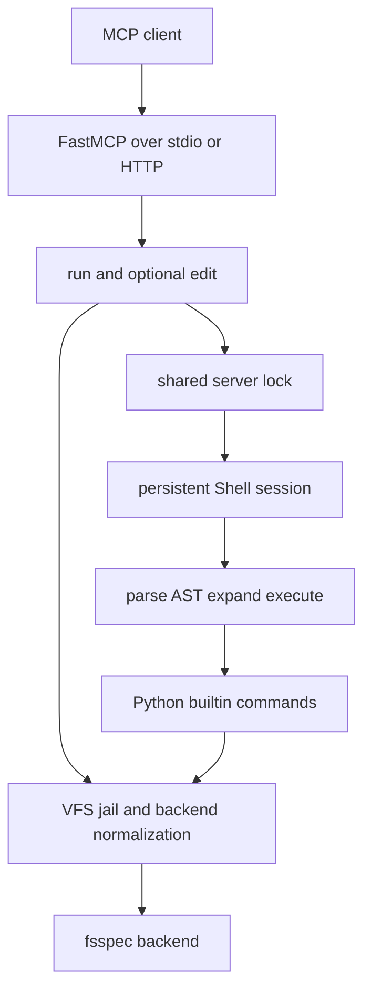

# mcpath Quickstart and Repository Map

mcpath exposes one folder or fsspec URL as a jailed, bash-like shell over MCP. It interprets shell syntax and Python builtins without spawning host processes, and persistent storage access belongs behind `VFS` rather than direct host I/O. This page gets a coding agent to a working server and a useful repository model; follow the task links instead of treating this overview as the full specification.

## Prerequisites and setup

mcpath requires **Python 3.13+** and uses [uv](https://docs.astral.sh/uv/) for environment and command execution.

```sh
git clone <this repo>
cd mcpath
uv sync
uv run mcpath --help
```

The installed console entrypoint is `mcpath`, mapped to `mcpath:main`. The positional `ROOT` defaults to the current directory and may be a local directory or an fsspec URL such as `memory://scratch` or `s3://bucket/prefix`.

## Start it and prove the protocol path

Run a local folder over the default stdio transport:

```sh
uv run mcpath ./some/project --read-only
```

The equivalent development recipe is:

```sh
just serve ./some/project --read-only
```

Both commands wait for an MCP client on stdin/stdout; stdio stdout is reserved for MCP protocol traffic. To serve HTTP instead:

```sh
uv run mcpath ./some/project --transport http --host 127.0.0.1 --port 8000
```

Open MCP Inspector against a real stdio server:

```sh
just inspect ./some/project --read-only
```

Then visit `http://localhost:6274`. For a non-interactive smoke test, make one real MCP `tools/call` request through Inspector CLI:

```sh
just call ./some/project "ls | wc -l"
```

These `just` recipes invoke `uv run mcpath`; `just call` specifically calls the `run` tool over the protocol rather than calling `Shell` directly.

## The MCP surface in one minute

A writable server presents two tools:

- `run(command)` executes supported bash-like syntax using Python builtins. Its response is terminal text; a nonzero shell status is still a successful MCP tool result and ends with `[exit N]`. The shell working directory and variables persist between calls.
- `edit(path, old_string, new_string, replace_all=False)` performs an exact UTF-8 text replacement. By default the old text must occur exactly once; `replace_all=True` replaces every occurrence, and an empty `old_string` creates a file only when it does not already exist. Relative edit paths use the shell's current directory.

With `--read-only`, `edit` is not registered at all. Mutating shell commands and redirections are also rejected by the VFS, so removing the tool is not the only read-only control. Output from `run` is limited to 30,000 characters by default, preserving its beginning and end; change this with `--max-output N`.

<!-- openwiki: broken internal link [reference/tools-and-command-surface.md] file "reference/tools-and-command-surface.md" does not exist. Fix the href or restore the target, then delete this comment. -->
For complete schemas, commands, supported syntax, options, and exit behavior, use [MCP Tools and Supported Shell Surface](reference/tools-and-command-surface.md).

## Runtime mental model



*One server owns a persistent shell and serializes tool calls; every durable filesystem operation crosses the VFS boundary before fsspec.*

The runtime layers are intentionally narrow:

1. **CLI and transport — `src/mcpath/__init__.py`, `src/mcpath/server.py`.** `main` parses mount, policy, output, and transport options; constructs the `VFS`; and starts FastMCP. `create_server` creates one `Shell`, registers `run` and, when writable, `edit`, and protects both with one lock so concurrent calls cannot interleave shared `cwd` or environment state.
2. **Shell language — `src/mcpath/shell/`.** The parser adapts bash syntax into mcpath AST nodes, expansion handles variables, substitutions, braces and globs, and the executor combines pipelines, redirects, conditionals, loops, and copied subshell state. Only simple commands dispatch to the builtin registry. Pipelines are buffered and executed stage by stage, not as operating-system processes.
3. **Builtin command layer — `src/mcpath/shell/builtins/`.** Registered Python functions consume shell-provided streams and a `CommandContext`; there is no arbitrary executable lookup. Builtins that read or change files must use the session's VFS.
4. **Security and storage boundary — `src/mcpath/vfs.py`.** `VFS` normalizes virtual paths below `/`, applies deny patterns, rejects escaping local symlinks, enforces read-only mutation checks and a per-file read limit, translates backend errors to virtual paths, and normalizes behavior across fsspec backends.
5. **Backend — fsspec.** Local disk, memory, object-store, archive, and other supported URLs enter through `VFS.from_url`; upper layers remain backend-agnostic.

Two lifecycle facts matter when debugging behavior. First, one `Shell` is created per `create_server` call, so its `cwd`, variables, and latest status survive later tool calls for the life of that server process. Second, the lock serializes complete calls but does not create per-client state; an HTTP server instance still has the one captured shell.

For the detailed startup and request sequence, ownership, failure classification, and concurrency invariants, read [Runtime Architecture and End-to-End Requests](architecture/runtime-architecture.md).

## The boundary agents must preserve

**All storage access belongs behind `VFS`.** New builtins should use the VFS on `CommandContext` or the shell session; a new MCP tool that touches mounted content should use the same VFS and, when shell state is involved, the same server lock. Do not use host `open`, direct `os` mutation calls, or expose fsspec backend paths from shell or tool code. Otherwise path confinement, deny rules, symlink checks, read-only policy, backend consistency, size limits, and sanitized errors can be bypassed.

Read-only behavior is defense in depth:

1. server registration removes `edit`;
2. VFS mutation methods return a read-only filesystem error, covering mutating builtins and output redirections too.

Before changing this boundary, read [Virtual Filesystem, Jail, and Storage Semantics](concepts/virtual-filesystem-security.md).

## Run tests and choose the narrow suite

Run everything:

```sh
just test
```

Extra arguments pass directly to pytest, so focused checks are straightforward:

```sh
just test tests/test_server.py
just test tests/test_vfs.py
just test tests/shell/test_parser.py tests/shell/test_expand.py tests/shell/test_executor.py
just test tests/shell/test_builtins.py
just test -k read_only
```

Use the suite closest to the contract you changed:

| Change | First focused test | What it proves |
| --- | --- | --- |
| MCP tool schema, result shape, locking, `edit`, or read-only exposure | `tests/test_server.py` | Real FastMCP client behavior over its in-memory transport, including discovery, validation, state, output formatting, and tool errors. |
| Jail, denies, symlinks, backend errors, reads, or mutations | `tests/test_vfs.py` | Most VFS behavior on both memory and local backends, plus local-only symlink containment. |
| Syntax or AST adaptation | `tests/shell/test_parser.py` | Source text maps to the repository-owned AST contract, independently of bashlex internals. |
| Quoting, parameters, splitting, braces, or globs | `tests/shell/test_expand.py` | Expansion behavior, including differential comparisons with real bash when available. |
| Pipelines, redirects, state, control flow, or statuses | `tests/shell/test_executor.py` | Agent-visible terminal output and exit status over an in-memory VFS. |
| Builtin options or GNU-like behavior | `tests/shell/test_builtins.py` | stdout, stderr, exit status, and for mutations the resulting tree, compared with real GNU tools. |

<!-- openwiki: broken internal link [testing/validation-strategy.md] file "testing/validation-strategy.md" does not exist. Fix the href or restore the target, then delete this comment. -->
After a focused suite, run `just test` for cross-layer regressions. See [Testing and Validation Strategy](testing/validation-strategy.md) for fixture design, differential-test prerequisites, and how to add coverage without testing only implementation details.

## Route by task

| If you are changing or investigating… | Start here |
| --- | --- |
| Startup, ownership, request flow, locking, state lifetime, or failure propagation | [Runtime Architecture and End-to-End Requests](architecture/runtime-architecture.md) |
| Traversal confinement, denies, local symlinks, read-only enforcement, fsspec behavior, or error sanitization | [Virtual Filesystem, Jail, and Storage Semantics](concepts/virtual-filesystem-security.md) |
| Parsing, AST contracts, expansion, substitutions, pipelines, redirects, control flow, or session copying | [Shell Language Pipeline: Parse, Expand, and Execute](concepts/shell-engine.md) |
| A builtin command, option parsing, stream behavior, GNU compatibility, `find`/`xargs`, `grep`, or recursive file operations | [Builtin Command System and Specialized Semantics](concepts/builtin-command-system.md) |
<!-- openwiki: broken internal link [reference/tools-and-command-surface.md] file "reference/tools-and-command-surface.md" does not exist. Fix the href or restore the target, then delete this comment. -->
| Public MCP tool inputs/results, available commands, supported syntax, or exit conventions | [MCP Tools and Supported Shell Surface](reference/tools-and-command-surface.md) |
<!-- openwiki: broken internal link [operations/configuration-and-deployment.md] file "operations/configuration-and-deployment.md" does not exist. Fix the href or restore the target, then delete this comment. -->
| CLI options, stdio versus HTTP, MCP client setup, Inspector, fsspec URLs, or deployment troubleshooting | [Configuration, Transports, and Deployment](operations/configuration-and-deployment.md) |
<!-- openwiki: broken internal link [testing/validation-strategy.md] file "testing/validation-strategy.md" does not exist. Fix the href or restore the target, then delete this comment. -->
| Selecting tests, cross-backend coverage, protocol tests, or bash/GNU differential tests | [Testing and Validation Strategy](testing/validation-strategy.md) |
| A cross-layer shell change and the contracts that must move together | [Workflow for Safely Changing Shell Behavior](workflows/changing-shell-behavior.md) |

A useful default sequence for implementation work is: identify the public behavior, inspect the owning layer, preserve the VFS boundary, add the narrowest regression test, then verify through `tests/test_server.py` whenever the observable MCP contract changes.
