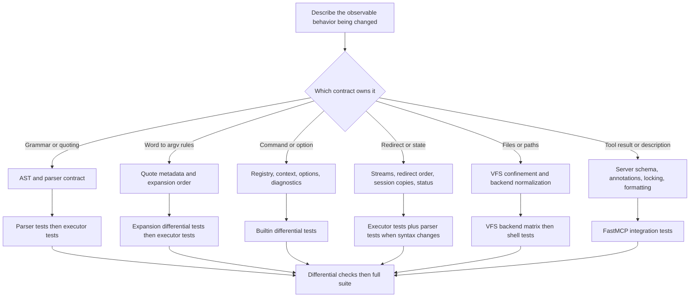

# Workflow for Safely Changing Shell Behavior

A shell change is rarely local. Source text crosses a position-sensitive parser, an immutable internal AST, quote-aware expansion, ordered stream wiring, builtin dispatch, the VFS security boundary, and finally MCP presentation. Change the contract at the owning layer, then move every dependent layer and its focused tests together.

<!-- openwiki: broken internal link [../reference/tools-and-command-surface.md] file "../reference/tools-and-command-surface.md" does not exist. Fix the href or restore the target, then delete this comment. -->
<!-- openwiki: broken internal link [../testing/validation-strategy.md] file "../testing/validation-strategy.md" does not exist. Fix the href or restore the target, then delete this comment. -->
Use this page as the implementation checklist. For background, see [Shell Language Pipeline](../concepts/shell-engine.md), [Builtin Command System](../concepts/builtin-command-system.md), [Virtual Filesystem Security](../concepts/virtual-filesystem-security.md), [Tools and Command Surface](../reference/tools-and-command-surface.md), and [Validation Strategy](../testing/validation-strategy.md).

## Start by classifying the change



*The owning contract determines the first focused suite; cross-layer, differential, and full-suite checks follow after the narrow test is green.*

Before editing, write down:

- one representative command and its expected stdout, stderr, exit code, filesystem result, and session result;
- whether the behavior should match Bash or a GNU utility, or is an intentional jailed-shell difference;
- which quoting modes, redirect orders, path spellings, and failure cases can distinguish the old and new behavior;
- whether the result is visible through `run`, changes the advertised command/syntax surface, or changes read-only/destructive behavior.

## Contracts that must remain aligned

### Parser and immutable AST boundary

`parser.py` is the only layer that consumes `bashlex` objects. It translates them into frozen, slotted dataclasses from `ast.py`; the executor consumes only that internal AST and never reparses source text. Treat the AST as a durable interface, not as parser scratch space. Expansion and execution must derive values rather than mutate nodes.

Quote provenance is semantic data. `Text`, `Param`, and `CommandSub` each carry `quoted`; expansion uses that bit to decide brace processing, field splitting, and globbing. A parser change that produces the same characters with different quote flags is therefore a behavioral change. Preserve quoted empty arguments too: `""` exists, while an unquoted unset expansion may disappear.

Heredocs need extra care. The pre-pass rewrites quoted delimiters to an equal-length, space-padded form before `bashlex` runs and records the `<<` positions. Equal length is an invariant: the adapter later slices source by parser-reported offsets to reconstruct quote metadata. The scan must remain quote-aware and skip heredoc bodies, including bodies with unbalanced quotes. A quoted delimiter yields a literal quoted `Text`; an unquoted body is represented as double-quoted-like parts so parameters and command substitutions run without splitting or globbing.

Redirect tuples also preserve source order. Parser normalizations such as `&> file` produce `FileRedirect(1, ...)` followed by `DupRedirect(2, 1)`, and `|&` appends duplication to the left command. Do not replace an ordered tuple with a descriptor map or sort redirects.

### Expansion contract

For ordinary words, preserve the implemented order: brace expansion, tilde expansion, parameter and command substitution, field splitting, globbing, with quote removal already encoded by the parser. Keep assignment and heredoc expansion on their narrower paths: `expand_assignment()` permits tilde and scalar substitution but no splitting or globbing, while `expand_string()` produces exactly one string.

Globbing is storage-sensitive. It walks one component at a time through `session.vfs`, returns names in the style the user wrote, sorts results, hides entries the VFS does not expose, and preserves an unmatched pattern. Never implement it with host `glob`, `pathlib`, or `os` calls. Redirect targets use full word expansion and must produce exactly one field; zero or multiple fields are an ambiguous redirect and status 1.

### Execution, redirects, and state

The executor applies redirects from left to right to the current descriptor mapping. Duplication captures the stream object mapped at that moment. Consequently, `>f 2>&1` and `2>&1 >f` are observably different. Output files are created or truncated during redirect setup, before builtin execution, and opened outputs are closed after execution or a later setup failure.

State-copy boundaries are part of Bash compatibility:

- groups, sequences, and ordinary control flow reuse the active `Session`, so `cwd` and environment changes can persist;
- parenthesized subshells and command substitutions use `Session.copy()`;
- every stage of a multi-command pipeline receives a session copy, including the final stage;
- `Session.copy()` clones `env` but deliberately shares the `VFS`, so shell state is isolated while file mutations remain visible.

Prefix assignments are passed in `CommandContext.env` only for that command. Assignment-only commands update persistent `session.env`. All executor nodes return a status and update `last_status`; parse errors use 2, an unknown command uses 127, and the loop guard fails with 1.

### Builtin boundary and diagnostics

A builtin is a registered `Callable[[CommandContext], int]`. It reads and writes only the supplied streams, uses `ctx.env` for command-local environment, resolves paths through `ctx.resolve()`, and performs storage operations through `ctx.vfs`. It must not open host paths, invoke a subprocess, or infer where its output is routed. `find -exec` and `xargs`-style nested execution must use `ctx.run_command`, which re-enters the same builtin registry.

Use the shared GNU-style option parser unless the utility has intentionally different option syntax. It supports short bundles, value-taking options, repeatable options, operands interspersed with options, `--`, unambiguous long prefixes, and automatic `--help`. A rejected option prints the supported option surface; the builtin should return 2 when `o.parse()` returns `None`.

Keep diagnostics in terms of paths the user typed. Resolve a path for the VFS operation, but retain the original operand for `ctx.os_error()` or command-specific wording such as `cannot access 'src/x'`. This avoids exposing normalized or backend paths and matches GNU output. Follow the command's established status convention: generally 0 for success, 1 for operational failure, 2 for bad options or shell syntax, and 127 for command lookup failure. Preserve command-specific GNU statuses where tests establish them, such as `ls` returning 2 for access errors.

### VFS is the storage security boundary

Every shell, builtin, glob, redirect, and MCP edit operation must reach storage through `VFS`. Public VFS methods normalize virtual paths, enforce deny patterns, reject local symlinks that resolve outside the root, enforce read-only mode on mutations, normalize backend edge cases, and translate backend errors so only virtual paths escape. A direct backend or host-filesystem shortcut bypasses these guarantees.

When changing file semantics, keep the checks centralized in public VFS operations. Test both memory and local backends because they disagree on cases such as directory reads and missing parents. Add local-only tests for symlink behavior when path traversal changes. Security failures must remain ordinary `OSError` subclasses with useful `errno`, `strerror`, and a virtual `filename` so the shell can format standard diagnostics.

## Change checklists

### Adding syntax or an AST node

- [ ] Specify precedence, associativity, quote behavior, redirects, status, and state-copy behavior with examples.
- [ ] Add a frozen, slotted dataclass in `src/mcpath/shell/ast.py`; use tuples rather than mutable child collections and add it to `Node` or the relevant union and `__all__`.
- [ ] Adapt only `src/mcpath/shell/parser.py` from `bashlex` into the internal node. Keep `bashlex` types out of all downstream APIs.
- [ ] If the heredoc pre-pass changes, preserve source length and parser positions, skip quoted text and heredoc bodies, and test multiple pending heredocs.
- [ ] Preserve `quoted` metadata for every word part and the representation of quoted empties.
- [ ] Preserve redirect order and explicit default file descriptors in the AST.
- [ ] Add executor dispatch with an explicit session reuse/copy decision and status propagation.
- [ ] Add direct source-to-AST cases and unsupported/error cases in `tests/shell/test_parser.py`.
- [ ] Add an end-to-end case in `tests/shell/test_executor.py`, including state leakage and redirects where relevant.
- [ ] If syntax is advertised to agents, update the server description and `tests/test_server.py` in the same change.

### Changing expansion

- [ ] Identify the exact phase and prove that its position relative to braces, tilde, substitution, splitting, and globbing is unchanged or intentionally changed.
- [ ] Check unquoted, single-quoted, double-quoted, escaped, empty, mixed-part, assignment, heredoc, and redirect-target forms.
- [ ] Keep generated values tagged by quote provenance; do not flatten a `Word` too early.
- [ ] Run command substitutions in a copied session, capture only stdout, preserve surrounding stderr, and strip trailing newlines.
- [ ] Use only VFS operations for glob traversal and retain written path style, dotfile rules, sorted output, deny filtering, and no-match behavior.
- [ ] Add focused differential cases to `tests/shell/test_expand.py`, plus explicit tests for intentional VFS differences.
- [ ] Add executor coverage if argv cardinality, redirect ambiguity, output, status, or session state changes.

### Adding a builtin or option

- [ ] Register the function with `@builtin(...)`; if it is in a new module, import that module from `src/mcpath/shell/builtins/__init__.py` so registration occurs.
- [ ] Define options once with `Opt`; decide whether operands may be permuted and whether aliases share a `dest`.
- [ ] Return 2 after option-parser rejection. Match GNU behavior for missing operands, partial failures, and utility-specific statuses.
- [ ] Consume `ctx.stdin` for no operand or `-` when the utility requires it, and write only through `ctx.out()`, `ctx.write()`, or context streams.
- [ ] Resolve each path through `ctx.resolve()` and call only `ctx.vfs`; retain the typed operand for diagnostics and displayed names.
- [ ] Continue over operands when GNU does, accumulating the correct final status without losing output/error order.
- [ ] Use `ctx.run_command` for nested commands rather than shell text, subprocesses, or direct registry calls.
- [ ] Add read-only or mutating differential cases in `tests/shell/test_builtins.py`. For mutations, compare resulting trees as well as stdout, stderr, and status.
- [ ] Add focused executor coverage when the command interacts with shell state, streams, redirects, or interleaving.
- [ ] Check that command-not-found output and MCP command descriptions now expose the registered name as intended.

### Changing filesystem semantics

- [ ] Put the behavior in `VFS`, not in one builtin, if all callers need the same security or POSIX rule.
- [ ] Start every public operation with `_check()` or `_check_writable()` as appropriate; never map an unchecked path with `_real()`.
- [ ] Preserve root clamping for `..`, deny checks by path component, outside-root symlink rejection, and read-only enforcement.
- [ ] Translate backend exceptions to virtual-path `OSError` values and avoid leaking `_root` or backend URLs.
- [ ] Define missing-parent, file-versus-directory, overwrite, recursive, and root-operation behavior before calling the backend.
- [ ] Add the behavior to the memory/local parameterized matrix in `tests/test_vfs.py`; add local symlink tests where applicable.
- [ ] Add shell-level tests for user-visible wording, typed paths, status, globs, redirects, or read-only behavior.
- [ ] Add builtin differential mutation coverage if GNU semantics are affected.

### Changing MCP-visible behavior

- [ ] Decide whether the tool schema, required arguments, description, available tool set, or annotations change.
- [ ] Preserve one `Shell` per server and the lock around both `run` and `edit`; state persists across calls and concurrent operations must not interleave.
- [ ] Keep shell command failures as normal tool results, with `[exit N]` appended for nonzero status, rather than MCP tool errors.
- [ ] Preserve output truncation's beginning and end unless intentionally changing the presentation contract.
- [ ] Route `edit` reads and writes through the same VFS and resolve relative paths against the shell's current directory.
- [ ] In read-only mode, verify the `edit` tool remains absent and the `run` annotations and description remain accurate.
- [ ] Add or update real in-memory FastMCP client assertions in `tests/test_server.py` for listing, schema, annotations, result text, errors, persistence, and concurrency as applicable.
- [ ] Exercise the protocol manually with `just call <root> "<command>"` when the change depends on serialization or model-facing formatting.

## Validation order

Validate from the narrowest owner outward. Fast feedback makes it easier to tell a parser defect from an expansion defect or a VFS defect from a builtin-formatting defect.

```bash
# Pick the owning suite first
just test tests/shell/test_parser.py
just test tests/shell/test_expand.py
just test tests/shell/test_executor.py
just test tests/shell/test_builtins.py
just test tests/test_vfs.py
just test tests/test_server.py

# Narrow further while iterating
just test tests/shell/test_executor.py -k redirect_order
just test tests/shell/test_builtins.py -k grep

# Finish with the complete suite
just test
```

Recommended sequence:

1. Run the smallest new test and its owning file.
2. Run adjacent contract suites: parser changes usually need executor tests; VFS changes usually need builtin and server tests.
3. Run the Bash/GNU differential cases after focused deterministic tests pass.
4. Run `just test` before merging.
5. For an MCP presentation or schema change, optionally run `just call` or `just inspect` after the automated FastMCP tests.

Differential tests are executable specifications, but they carry a safety rule: commands in `tests/shell/test_builtins.py` are run in **real Bash** as well as mcpath. Use only relative paths that stay inside the generated fixture. Never add `/`, absolute host paths, parent traversal that can escape the fixture, or a command whose effect is not safely confined. Expansion differential tests also invoke real Bash in their fixture directory, so apply the same discipline there.

## Review failure modes

Before approval, actively look for these regressions:

- a heredoc rewrite shifted source positions, causing later words to inherit the wrong quote metadata;
- an AST node or child list became mutable and one execution contaminates a later execution;
- quote flags were flattened before splitting or globbing;
- redirects were grouped by descriptor instead of applied in textual order;
- a subshell, command substitution, or pipeline stage reused the parent session, or a group copied it;
- a copied session accidentally copied storage, hiding file effects, instead of sharing the VFS;
- a builtin used a normalized virtual path in diagnostics instead of the user-typed operand;
- a builtin touched `os`, `pathlib`, an fsspec backend, or a subprocess and bypassed the VFS jail;
- a mutation forgot `_check_writable()`, or a listing exposed denied or escaping-symlink entries;
- an option or syntax error returned 1 instead of its established 2, or command lookup stopped returning 127;
- shell failure became an MCP error instead of terminal text plus `[exit N]`;
- a new command works internally but is absent from import-time registration, MCP descriptions, or differential tests.

A safe change leaves one coherent story from source text to AST, argv, streams, VFS effects, exit status, and MCP result. If any layer has to guess what the preceding layer meant, the contract is not yet complete.
